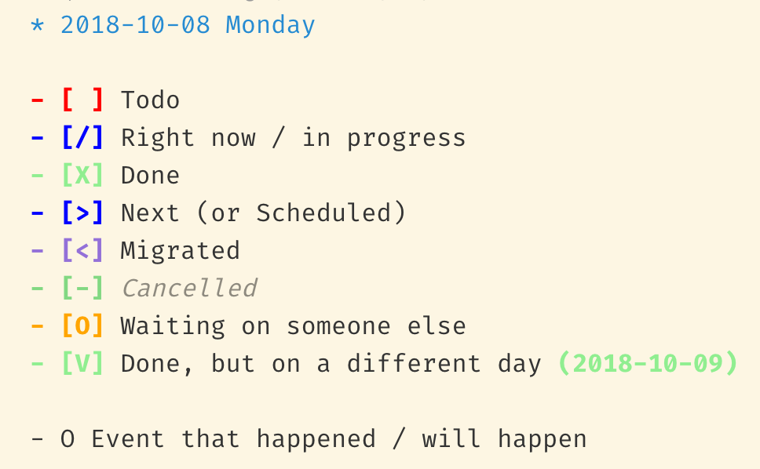

# org-checkboxes

Add checkbox highlighting to `org` and `md` grammars.

_(Note: Much of the content in the Developing and Building / Installing sections below comes from text generated by [Yeoman](https://code.visualstudio.com/api/get-started/your-first-extension).)_

## Description

This grammar for the [VSCode text editor](https://code.visualstudio.com/) adds coloring for unordered list checkboxes in `org-mode` and `markdown` text. This facilitates creating simple [Bullet Journal](http://bulletjournal.com/) files using [`org-mode`](http://ergoemacs.org/emacs/emacs_org_markup.html) or [markdown](https://daringfireball.net/projects/markdown/) syntax.

The package is written by [Jacob Levernier](https://adunumdatum.org), and is a port of a [similar extension for the Atom text editor](https://github.com/publicus/atom-language-org-checkboxes), also by Jacob Levernier, which was released under an [MIT license](https://github.com/publicus/atom-language-org-checkboxes/blob/master/LICENSE). This package is released under a [BSD 3-Clause license](https://opensource.org/licenses/BSD-3-Clause).

It highlights the following:

- Todo:
  - `- [ ] Example item`
  - `- [] Example item`
  - `- TODO Example item`
  - `- TO DO Example item`
  - `- TO-DO Example item`
  - `- TO_DO Example item`
- Done:
  - `- [X] Example item`
  - `- [x] Example item`
  - `- DONE Example item`
- Done, but on a different day (Date or reference goes in parentheses at the end of the line)
  - `- [V] Example item (1970-01-01)`
  - `- [v] Example item (1970-01-01)`
  - `- DONE LATER Example item (1970-01-01)`
  - `- DONE-LATER Example item (1970-01-01)`
  - `- DONE_LATER Example item (1970-01-01)`
  - `- DONELATER Example item (1970-01-01)`
- Next / Scheduled:
  - `- [>] Example item`
  - `- NEXT Example item`
- Migrated / Moved:
  - `- [<] Example item`
  - `- MIGRATED Example item`
  - `- MOVED Example item`
- Right now / In progress:
  - `- [/] Example item`
  - `- RIGHT NOW Example item`
  - `- RIGHT-NOW Example item`
  - `- RIGHT_NOW Example item`
  - `- RIGHTNOW Example item`
  - `- NOW Example item`
  - `- IN PROGRESS Example item`
  - `- IN-PROGRESS Example item`
  - `- IN_PROGRESS Example item`
  - `- INPROGRESS Example item`
- - Waiting on someone else / Blocked:
  - `- [O] Example item`
  - `- WAITING Example item`
  - `- BLOCKED Example item`
- Canceled:
  - `- [-] Example item`
  - `- CANCELED Example item`
  - `- CANCELLED Example item`
- Event:
  - `- O Example item`
  - `- EVENT Example item`



The package extends existing highlighters for `org-mode` and `markdown` syntax.

## Use

1. Install the extension through VSCode.
1. (Optional) Enable color highlighting:
  1. In VSCode, from the Command Palette (`Cmd + Shift + P` or `Ctrl + Shift + P`), run "`Preferences: Open Settings (JSON)`".
  2. Add the following within the outermost curly braces (`{`...`}`) of the JSON file that opens[^1]:
      ```
      "editor.tokenColorCustomizations": {
        "textMateRules": [
          {
            "scope": ["keyword.checkbox-todo"],
            "settings": {
              "foreground": "#FF0000",
              "fontStyle": "bold"
            }
          },
          {
            "scope": ["keyword.event"],
            "settings": {
              "foreground": "#6E3500",
              "fontStyle": "bold"
            }
          },
          {
            "scope": ["keyword.checkbox-malformed"],
            "settings": {
              "foreground": "#FF00FF",
              "fontStyle": "bold"
            }
          },
          {
            "scope": ["keyword.checkbox-right_now"],
            "settings": {
              "foreground": "#0000FF",
              "fontStyle": "bold"
            }
          },
          {
            "scope": ["keyword.checkbox-next"],
            "settings": {
              "foreground": "#0000FF",
              "fontStyle": "bold"
            }
          },
          {
            "scope": ["keyword.checkbox-migrated"],
            "settings": {
              "foreground": "#9370D8",
              "fontStyle": "bold"
            }
          },
          {
            "scope": ["keyword.checkbox-waiting"],
            "settings": {
              "foreground": "#FFA500",
              "fontStyle": "bold"
            }
          },
          {
            "scope": ["keyword.checkbox-done"],
            "settings": {
              "foreground": "#90EE90",
              "fontStyle": "bold"
            }
          },
          {
            "scope": ["keyword.checkbox-strikethrough"],
            "settings": {
              "foreground": "#82d882",
              "fontStyle": "bold"
            }
          },
          {
            "scope": ["keyword.strikethrough-text"],
            "settings": {
              "fontStyle": "italic",
              "foreground": "#00000070",
            }
          },
          {
            "scope": ["keyword.bullet"],
            "settings": {
              "fontStyle": "bold"
            }
          }
        ]
      }
      ```

      You can customize the settings above. To see which "scope" to which a given element in your `org-mode` or `markdown` file corresponds, open the Command Palette, run `Developer: Inspect Editor Tokens and Scopes`, and move your text cursor to be over the checkbox in question.

      [^1]: This [currently must be done manually](https://github.com/microsoft/vscode/issues/97753#issuecomment-629135629).
1. In VSCode, set the language for the document as `Org` or `Markdown`.

I suggest this `org-mode`-based style for bullet-journal entries:

```org
* 1970-01-01 Thursday

  - [ ] Item 1
    - [ ] Sub-item 1
  - [ ] Item 2

  - O Event 1
  - O Event 2

  - Note 1
    - Sub-note 1
      #+BEGIN_QUOTE
        Some block-quote contents.
      #+END_QUOTE
```

Similarly, for Markdown files, you can use:

```md
# 1970-01-01 Thursday

  - [ ] Item 1
    - [ ] Sub-item 1
  - [ ] Item 2

  - O Event 1
  - O Event 2

  - Note 1
    - Sub-note 1
      <quote>
        Some block-quote contents.
      </quote>
```

By indenting, you can use VSCode's `Editor: Fold Current Row` / `Editor: Unfold Current Row` commands (from the `Ctrl + Shift + P` / `Cmd + Shift + P` menu) to collapse sections of your journal for easier reading.

When using `org-mode` files, this approach works well with [`Orgzly`](http://www.orgzly.com/) for Android, which can sync org-mode files using a service such as [Dropbox](https://www.dropbox.com) or [SyncThing](https://syncthing.net/), and allows checking boxes with a tap.

## Developing

- Press `F5` to open a new window with your extension loaded.
- You can relaunch the extension from the debug toolbar after making changes to the files listed above.
- You can also reload (`Ctrl+R` or `Cmd+R` on Mac) the VS Code window with your extension to load your changes.
- Examine tokenization using `Cmd+Shift+P -> Developer: Inspect TM Scopes`
- To add features such as intellisense, hovers and validators check out the VS Code extenders documentation at https://code.visualstudio.com/docs

### Building / Installing from source

1. Run `vsce package`

- Rather than manually copying the extension into `~/.vscode/extensions/`, this step will show any errors in the package.

1. Run `code --install-extension <path/to/package/file>` to copy the extension into `~/.vscode/extensions/`
1. Run `Cmd+Shift+P --> Developer: Reload Window` to reload VSCode.
1. Confirm that the extension is listed in the sidebar Extensions tab.

- To publish the extension, read on https://code.visualstudio.com/docs about publishing an extension.
